## Para empezar se inicia la aplicacion:
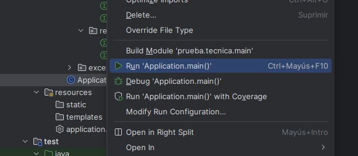

Para iniciar solo se oprime Run Aplication.main

Una vez iniciada la aplicacion se mostrará de la siguinte manera:

indicando el puerto por el que esta corriendo, una vez iniciada se procede a mostrar los endpoints, esta vez mediante PostMan

## Endpints

### Inicial
el princial es el sigueinte: http://localhost:8181/api/auth/create de tipo POST mediante el cual se creara un usuario para su autenticacion y envio de el JWT json wen token
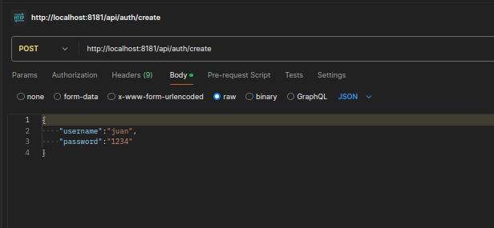

Se va a donde dice body y seleccionamos RAW se indica que es un cuerpo tipo json y en el cuerpo de el json va de la siguiente forma: 
{
"username":"juan",
"password":"1234"
}
Se oprime enviar y se muestra la respuesta
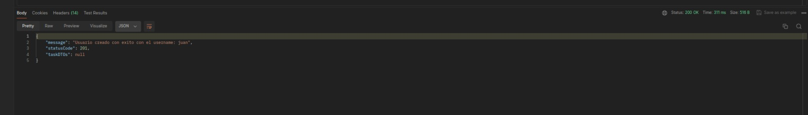

### JWT
Para obtener el JWT se ingresa por este endpoin: http://localhost:8181/api/auth/login de tipo POST que va tambien con un cuerpo igual al anterior 
{
"username":"juan",
"password":"1234"
}
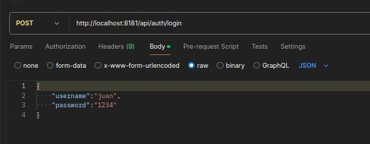

se presiona enviar y se mostrará un mensaje mostrando el JWT:
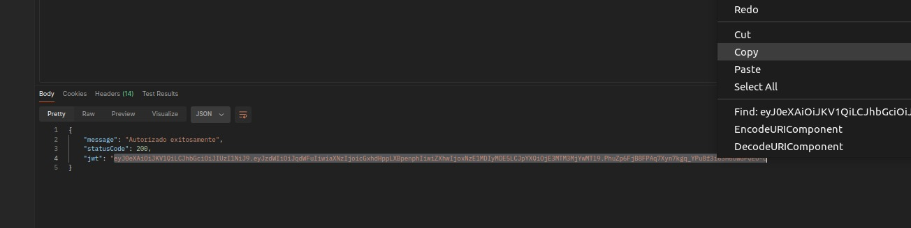

copiamos el JWT para usarlo en las siguiente consultas

### Create Task

Para crear una tarea se realiza por el siguiente puerto: http://localhost:8181/task tipo post

Pero primero se ingresa el JWT se ingresa al apartado de Authorization y se indica que es un Bearer token

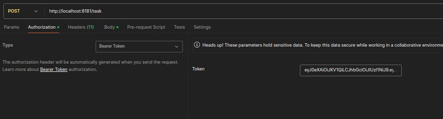

Tambien se puede realizar por el Header

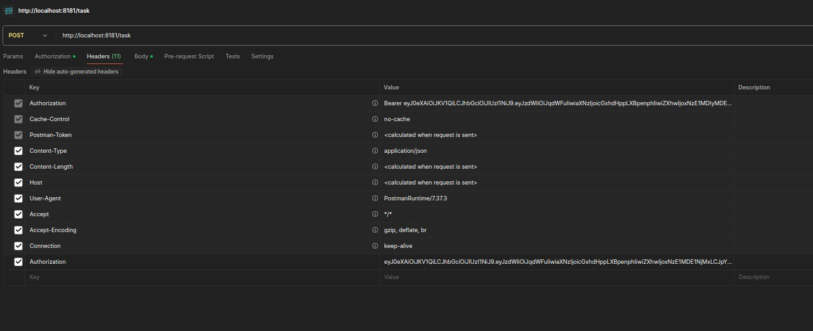
en Key se ingresa Authorization y en el value se pone el JWT

para ingresar una tarea tambien se indica el cuerpo:
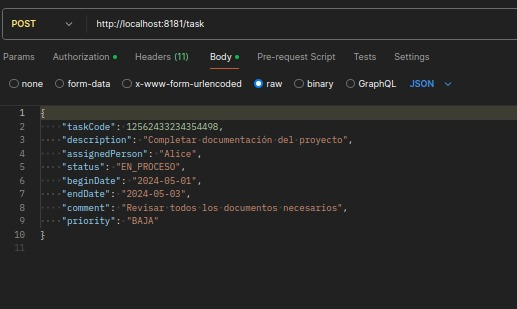
en ejemplo de como seria :   
{
"taskCode": 12562433234354498,
"description": "Completar documentación del proyecto",
"assignedPerson": "Alice",
"status": "EN_PROCESO",
"beginDate": "2024-05-01",
"endDate": "2024-05-03",
"comment": "Revisar todos los documentos necesarios",
"priority": "BAJA"
}
se envia y se recibe el mensaje de creacion exitosa
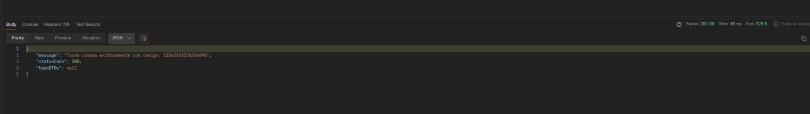

### Edit Task
Para la edicion se realiza lo mismo que en el anterior endpoint en cuanto al JWT mediante este puerto
http://localhost:8181/task/{taskCode}  una peticion tipo put donde taskCode es el codigo de la tarea
el cuerpo de la edicion completo es asi:
{
"status": "NUEVA",
"endDate": "2024-05-02",
"assignedPerson": "Jojhn Doe",
"comment": "Finalizada antes de tiempo."
}
pero se puede solo poner un campo o varios, todo depende lo que se requiere modificar
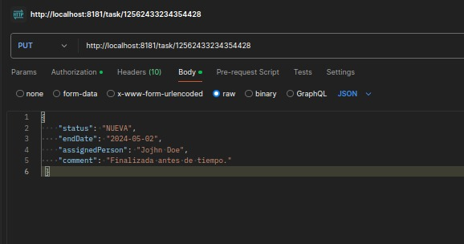

### Get All Task
Para consultar todos las tareas primero se hace lo anterior con JWT se hace una peticion mediante este endpoint:  http://localhost:8181/task/all una peticion tipo get
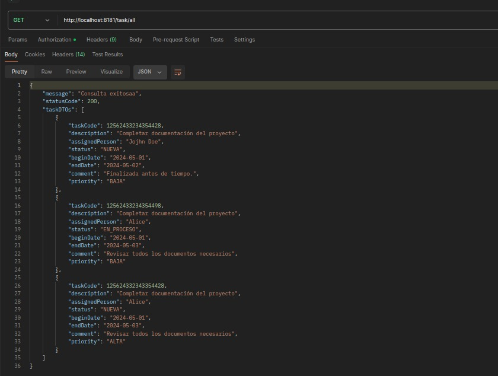
y se ven tods las las tareas que existen
### Get All Task OrderBy additionDate Asc and Des
Para consultar ordenando por fecha de adicion se realiza lo mismo que en el punto anterior con el JWT para consultar se hace mediante a este enpoint
: http://localhost:8181/task/aditionDate?order=asc  order=asc aca se especifica si se quiere acendente asc o decendente desc
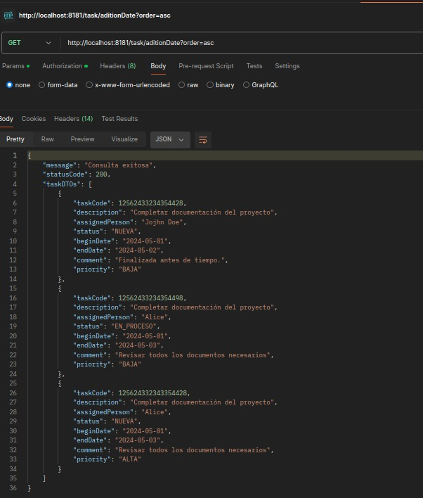

### consultar tareas ya sea por un campo en especifico o varios campos
Para este tipo de consulta se realiza lo anterior en cuanto al JWT, para consultar se hace mediante este enpoint:
http://localhost:8181/task/complex?priority=ALTA  se puede consulta por un campo especifico o por varios campos juntos, asi seria por uno en especifico
o se pueden indicar varios http://localhost:8181/task/complex?priority=ALTA&status=NUEVA
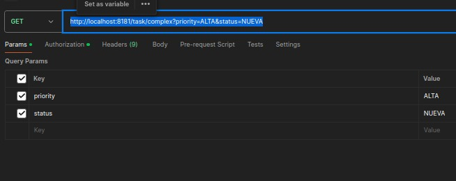
En los params se puede indicar por cual se puede consultar en la key se pone el nombre de el campo y en el value el valor por el cual se desea filtrar
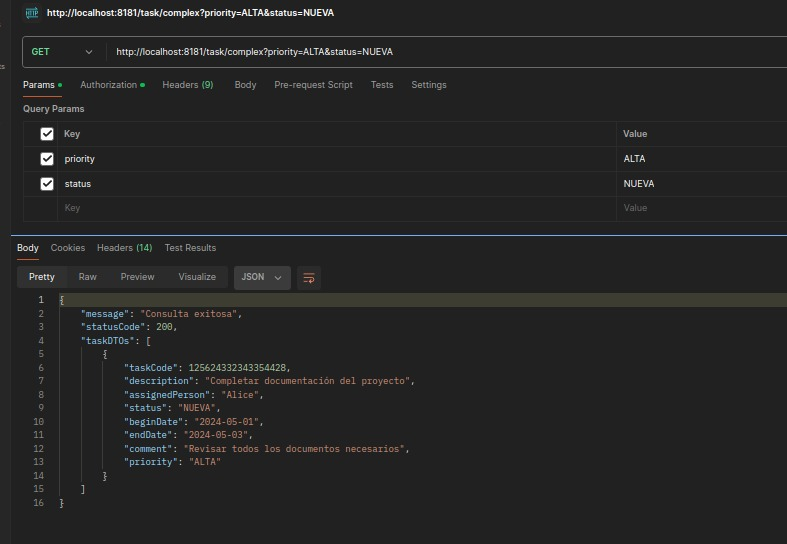

### Delete Task
Para la eliminacion de una tarea, se debe hacer lo mismo con el JWT y mediante este enpoint
http://localhost:8181/task/delete/{taskCode} donde taskCode es el codigo de la tarea ejemplo http://localhost:8181/task/delete/125624332343354428
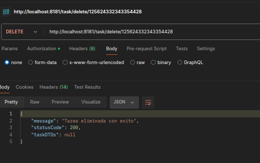
